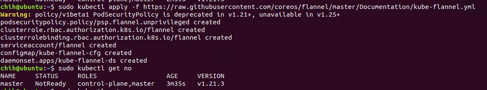
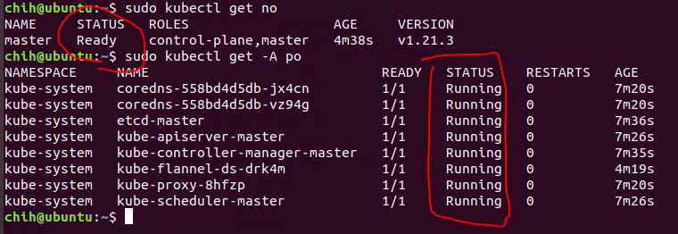
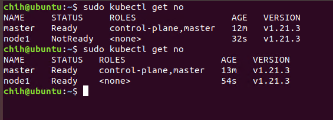
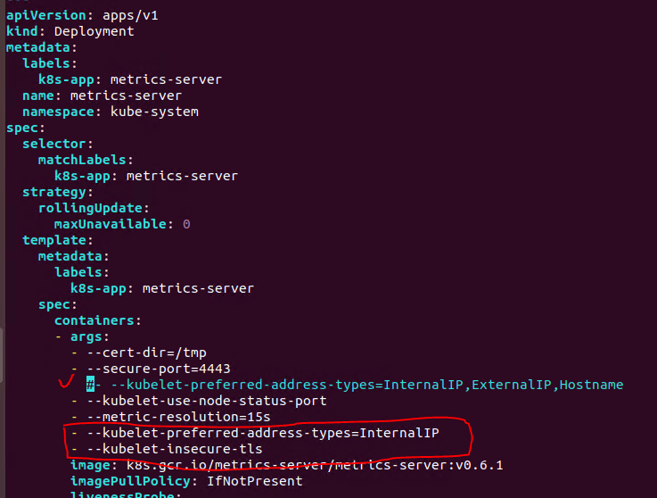
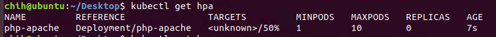
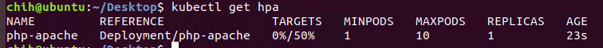
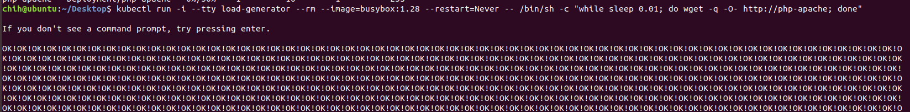
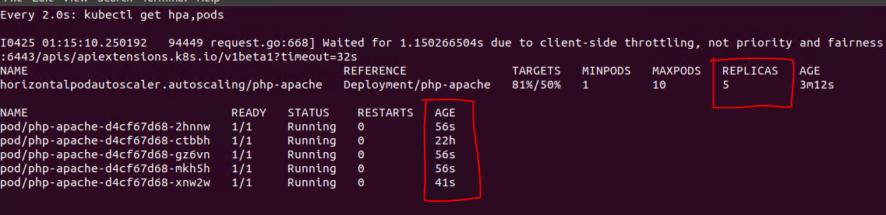

# Kubeadm-installation

## 安裝環境
- VM : 
  - 使用了兩台VM，一台當master、一台當worker node
  - software : VMware
  - memory : 4GB
  - OS : ubuntu 18.04 desktop
- Host :
  - OS : Win10
- Kubernetes version = "1.21.3-00"
## 特殊情況 (過程有問題再看)

💡 如果重開機有問題，操作完需要等一下，我通常用上面那個，master、worker node都需要執行，過一段時間在master端 "kubectl get nodes" 看是否成功 Ready

```
sudo swapoff -a
sudo strace -eopenat kubectl version

OR

sudo systemctl restart docker
sudo systemctl daemon-reload
sudo systemctl restart kubelet
```

💡 如果忘記Master 的 join token，也可以直接 "kubeadm reset" 後重跑 initial 一次產生新的 token

```
kubeadm token generate
kubeadm token create <generation_token> --print-join-command --ttl=0
```

💡 如果在 init 的時候出現下圖 WARNING 的問題，可以參考下面的連結解決，主要應該是 docker driver 設定的問題

[參考連結](https://cloud.tencent.com/developer/article/1815028)
```
CentOS -> /usr/lib/systemd/system/docker.service
Ubuntu -> /lib/systemd/system/docker.service
```


# Master & worker node 都須作設定
## 更新與安裝
```
sudo apt update
sudo apt upgrade
sudo apt install vim net-tools wget -y
```


## 網路設定

1. 查看master and node的IP，互相ping看看是否有通
    
    ```
    ifconfig
    ping <node_IP>
    ```
    
    
    
2. 設定hostname (可取名worker node1、master之類的，方便後面辨識)
    
    ```
    sudo hostnamectl set-hostname <name>
    ```
    
3. 編輯hosts檔案，可使用vim或是自己熟悉的編輯軟體
    
    ```
    sudo vim /etc/hosts
    ```
    
    
    
4. 安裝docker，查看version
    
    ```
    sudo apt-get install docker.io -y
    sudo docker version
    ```
    
    
    
5. 啟動docker並查看狀態
    
    ```
    sudo systemctl enable docker
    sudo systemctl start docker
    sudo systemctl status docker
    ```
    
    
    
6. 關閉swap
    
    ```
    sudo swapoff -a
    top
    ```
    
    
    

## 安裝kubeadm、kubelet 和 kubectl

```
sudo apt-get update && sudo apt-get install -y apt-transport-https curl
```

```docker
curl -s https://packages.cloud.google.com/apt/doc/apt-key.gpg | sudo apt-key add -

OR

# 執行上面那個
# sudo curl -fsSLo /usr/share/keyrings/kubernetes-archive-keyring.gpg https://packages.cloud.google.com/apt/doc/apt-key.gpg
```

```docker
cat <<EOF | sudo tee /etc/apt/sources.list.d/kubernetes.list
deb https://apt.kubernetes.io/ kubernetes-xenial main
EOF

OR

# 執行上面那個
# echo "deb [signed-by=/usr/share/keyrings/kubernetes-archive-keyring.gpg] https://apt.kubernetes.io/ kubernetes-xenial main" | sudo tee /etc/apt/sources.list.d/kubernetes.list
```

```docker
sudo apt-get update
```

## 安裝 kubelet、kubeadm、kubectl

我這邊是選擇安裝指定版本 "1.21.3-00"，如果要安裝新版本有些地方可能會需要大幅度修改，但我使用 "1.21.3-00" 版本跑後面的步驟是可以安裝成功的，新版本目前沒測試過。

```sh
# 安裝最新版本
sudo apt-get install -y kubelet kubeadm kubectl
sudo apt-mark hold kubelet kubeadm kubectl

OR

# 指定安裝版本
## 找到可用的版本 
apt-cache madison kubeadm

## 指定版本
K_VER="<version>"
## ex : K_VER="1.21.3-00"

sudo apt-get install -y kubelet=${K_VER} kubectl=${K_VER} kubeadm=${K_VER}
```


## 修改docker文件

[Reference](https://blog.csdn.net/M82_A1/article/details/97626309)

1. /etc/docker裡面創一個 daemon.json
    ```
    sudo vim /etc/docker/daemon.json
    ```

2. 加入這段
    ```
    {
    "exec-opts":["native.cgroupdriver=systemd"]
    }
    ```

3. 重啟docker
    ```
    sudo systemctl restart docker
    sudo systemctl status docker
    ```

</aside>

# Master端

1. 初始化master端的參數，這段主要是設定kubernetes後面一些元件可以使用的IP範圍，要注意最後有沒有出現 warning，這邊如果出現問題的話可以到上面的 "特殊情況" 第三點看看是不是一樣的問題
    ```sh
    # 跳過這段
    # export KUBECONFIG=/etc/kubernetes/admin.conf
    # sudo systemctl daemon-reload
    # sudo systemctl restart kubelet

    # 執行下面這個
    sudo kubeadm init   --pod-network-cidr=10.244.0.0/16 --service-cidr=10.245.0.0/16 --apiserver-advertise-address=<master_IP>
    ```

2. 最後應該會出現successfully的提示，還有後面的指令kubeadm join…要記錄起來，之後worker node才能透過那個token加入叢集中

3. 查看節點

    避免出現 “The connection to the server localhost:8080 was refused - did you specify the right host or port?”，這段在 init 的時候會有提示要執行

    ```sh
    mkdir -p $HOME/.kube
    sudo cp -i /etc/kubernetes/admin.conf $HOME/.kube/config
    sudo chown $(id -u):$(id -g) $HOME/.kube/config
    ``` 
    
    查看節點與狀態

    ```sh
    sudo systemctl status kubelet
    sudo kubectl get nodes
    ```

4. 這邊選擇 flannel 元件，也可以選擇其他的網路附加元件，如下圖，如果馬上讀取 node 狀態可能還是會 NotReady 狀態
    ```
    sudo kubectl apply -f https://raw.githubusercontent.com/coreos/flannel/master/Documentation/kube-flannel.yml
    ```
    

5. 需要等待一段時間(3-5 mins)，查看node列表，如果正常就會看到 master 是 Ready 狀態，並且所有的 pods 都會是在 Running 狀態。

    ```
    sudo kubectl get nodes
    ```

    - 如果一直顯示"Not Ready"，執行下面那行後重置，直接重做[Master](https://github.com/z416352/Kubeadm-installation#master端)的部分

        ```
        sudo kubeadm reset
        ```
    
    


6. 把先前 master 複製的指令 “kubeadm join  –token…..”在 worker node 執行
，這邊如果出現問題的話可以到上面的 "特殊情況" 第三點看看是不是一樣的問題
    ```
    sudo kubeadm join <master_IP:6443> --token.....
    ```

7. master 端執行，看有沒有出現 worker node 的資訊，並且 Ready，同樣可能會需要幾分鐘。

    ```
    sudo kubectl get nodes
    ```

    

8. 檢查componentstatuses狀態

    ```
    sudo kubectl get cs
    ```

    - 如果出現Unhealthy，cd 到/etc/kubernetes/manifests資料夾中，將 kube-controller-manager.yaml 和 kube-scheduler.yaml 這兩個檔案中的 –port=0 註解後重新執行

        ```
        sudo systemctl restart kubelet.service
        ```

## Metrics Server

[Metrics Server 參考網址](https://github.com/kubernetes-sigs/metrics-server#readme)

如果需要使用Auto Scaling的話就必須要安裝一個可以監控pods、nodes等等所消耗的CPU、Memory量，這邊我使用Metrics Server來監控資源使用量。

我使用k8s "1.21.3-00"版本，需要把Metrics Server網站提供的yaml檔案下載下來(可透過linux的"wget"指令)，將原本的參數註解之後改成這下面這兩個，如下圖 :
```bash
# 新增以下參數並註解掉原本的
- --kubelet-preferred-address-types=InternalIP
- --kubelet-insecure-tls
```


如果沒有安裝，那建立的 hpa 可能都會是下圖這個狀態。安裝成功後 Targets 就會正常的顯示。hpa如何建立可以看下節的 Auto Scaling 參考網址






## Auto Scaling
[Auto Scaling 實作參考網址](https://kubernetes.io/docs/tasks/run-application/horizontal-pod-autoscale-walkthrough/)

當成功的時候可以看到下圖，當不斷訪問我們我們建立的pod時，TARGETS的使用率就會不斷的飆升，當達到設定的50%時就會開始不斷scaling pod來達到分散流量的目的。

第二張圖片就是經過一段時間之後就多複製了4個pods，可以看到他們所產生的時間只有22h那個是最初的那個，其他的pods都是新建立的。



